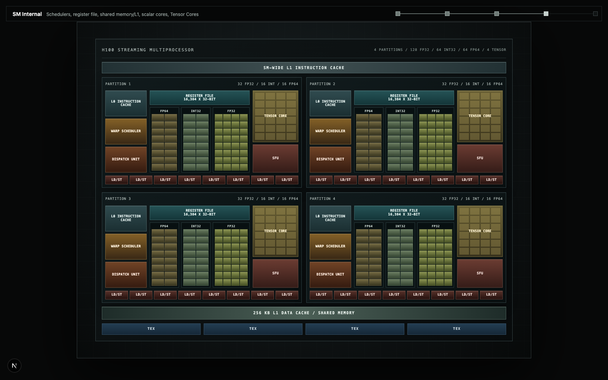

# H100 Dissected

An interactive, scroll-driven guide to the NVIDIA H100 and Hopper GPU architecture.

H100 Dissected connects the physical GPU package and compute hierarchy to the CUDA,
Triton, and PyTorch concepts developers use in code. The visualization moves from
the H100 package into the GH100 die, GPCs, TPCs, SMs, execution resources, and
software-to-hardware mapping.



## What It Covers

- H100 package, GH100 die, and HBM3 memory
- Physical hierarchy: GPU -> GPC -> TPC -> SM
- H100 SM internals, including scheduler partitions, register files, caches,
  scalar execution units, Tensor Cores, SFUs, and load/store paths
- Memory hierarchy: registers -> shared memory/L1 -> L2 -> HBM3
- PyTorch, Triton, and CUDA mapping through a concrete vector-add example
- Hover explanations with hardware context and programming examples

## Accuracy

The project distinguishes published hardware facts from explanatory diagrams.
Unit counts and hierarchy come from NVIDIA documentation. Internal block
placement is presented as a readable schematic, not as a transistor-accurate die
mask.

The full GH100 design contains 8 GPCs, 72 TPCs, and 144 SMs. The H100 SXM
configuration represented here exposes 132 SMs and 66 TPCs. NVIDIA does not
publish the exact physical location of every disabled unit, so disabled-unit
placement is intentionally schematic.

## Run Locally

```bash
npm install
npm run dev
```

Open [http://localhost:3000](http://localhost:3000).

Additional commands:

```bash
npm run lint
npm run build
```

## Deploy

The application is fully static and has no backend. Import the repository into
Vercel and use the default Next.js settings.

## Stack

- Next.js
- React
- TypeScript
- Tailwind CSS
- Playwright for visual validation

## Architecture Data

Source-backed architecture data is stored in
[`assets/architectures/nvidia-h100-hopper.json`](assets/architectures/nvidia-h100-hopper.json).

Primary references:

- [NVIDIA H100 Tensor Core GPU Architecture](https://resources.nvidia.com/en-us-tensor-core/nvidia-tensor-core-gpu-datasheet)
- [NVIDIA Hopper Architecture In-Depth](https://developer.nvidia.com/blog/nvidia-hopper-architecture-in-depth/)
- [CUDA Programming Guide](https://docs.nvidia.com/cuda/cuda-programming-guide/)
- [Triton vector-add tutorial](https://triton-lang.org/main/getting-started/tutorials/01-vector-add.html)

## Disclaimer

This is an independent educational project. It is not affiliated with or
endorsed by NVIDIA. NVIDIA, H100, Hopper, CUDA, and related names are trademarks
of their respective owners.
